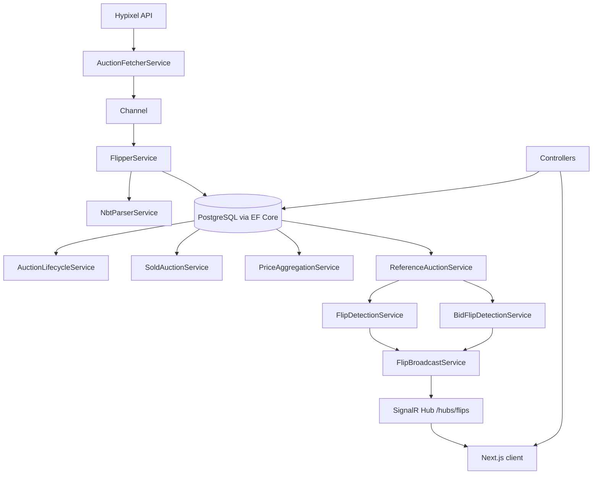

# Architecture

## Overview
SkyFlipperSolo is an ASP.NET Core 8 backend with EF Core + PostgreSQL, plus a Next.js frontend. Background services ingest auctions, normalize NBT, aggregate prices, and detect flips using Coflnet-style reference-auction matching.

## Mermaid Diagram

## Key Components
- Background ingestion: `AuctionFetcherService`, `FlipperService`, `SoldAuctionService`.
- Lifecycle: `AuctionLifecycleService` for expiration + integrity fixes.
- Pricing: `PriceAggregationService` with anti-manipulation and sold-time bucketing.
- Matching: `CacheKeyService` + `ReferenceAuctionService`.
- Detection: `FlipDetectionService` (BIN), `BidFlipDetectionService` (non-BIN).
- API: `AuctionsController`, `FlipsController`.
- Realtime: `FlipHub` via SignalR.

## Data Flow
1. Fetch auctions -> channel -> parse/store + NBT lookups.
2. Fetch ended auctions -> mark sold with SoldAt/SoldPrice.
3. Aggregate sold auctions to price history tables.
4. Use reference-auction selection to evaluate flips.
5. Publish flips to DB + SignalR; frontend consumes via REST + SignalR.

## Constraints
- Cache key and NBT logic must match Coflnet reference.
- Sold auctions must use `SoldAt` for price history windows.
- Do not edit `Migrations/` manually.
